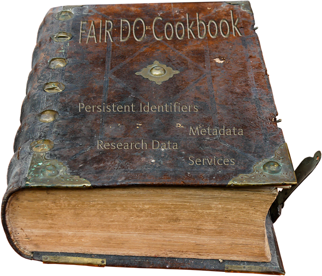

# Welcome

This cookbook shall guide the reader through the different use cases when adopting, maintaining and using FAIR Digital Objects.

    

## Target audience

This cookbook is targeted at people who:

- build, control or maintain infrastructure or clients that should work with FAIR DOs in some way.
- are interested in how types, profiles and records work and how they can be crated.

Future target groups are also planned:

- People who need to know about how a machine can understand and act on (e.g. record) information within FAIR DOs.

## About us

[Data Expoitation Methods (DEM)](https://www.scc.kit.edu/ueberuns/dem.php), is part of the Steinbuch Centre for Computing (SCC), located at Karlsruhe Institute of Technology (KIT).

    

        
    

