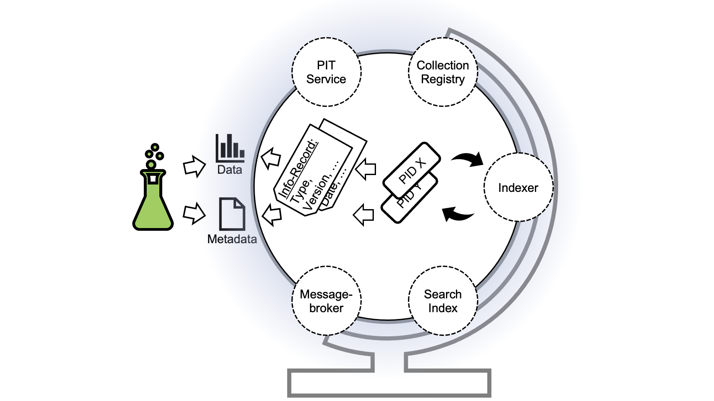

# FAIR DO Ecosystem Testbed

The FAIR Digital Object Ecosystem Testbed is developed at Karlsruhe Institute of Technology (KIT) as a contribution to the Helmholtz Metadata Collaboration (HMC)[^hmc] platform. HMC promotes the qualitative enrichment of research data by means of metadata – and implements this approach across the whole Helmholtz Association of German Research Centers.
The introduction of FAIR Digital Objects plays a dominant role in the development of technical services in HMC since it promises

- to harmonize the machine-actionable handling of research data objects on a concept level,
- to provide metadata for technical and semantic interoperability,
- to integrate a wide range of digital objects including data, software and other
research artifacts, and
- will enable the cross-disciplinary exploitation of the contents of big research data
collections.

[^hmc]: [https://www.hmc-plattform.org/en](https://www.hmc-plattform.org/en)

## Intention

The FAIR Digital Object Ecosystem Testbed intends to demonstrate the feasibility of FAIR DO usage, to allow easy access to FAIR DOs and to to drive discussions about the implementation.

The Testbed consists of a set of services to facilitate and demonstrate generic use cases for FAIR DOs, with a strong focus on PIDs and PID Information Records, and explicitly not covering data storage and repositories. It is not a hosted demonstrator. Instead, you can download and run it on your everyday computer[^testbedrepo]. As the services interact to fulfill some of the use cases, we describe them as an ecosystem. Yet, every service can be used independently[^testbedcomposeyml] [^kitdm].
The Testbed can also be used as an environment to test the interplay with other services (e.g. repositories).

[^testbedrepo]: Testbed instructions and download: [https://github.com/kit-data-manager/testbed4inf](https://github.com/kit-data-manager/testbed4inf)

[^testbedcomposeyml]: Service composition definition file in the testbed: [https://github.com/kit-data-manager/testbed4inf/blob/master/docker-compose.yml](https://github.com/kit-data-manager/testbed4inf/blob/master/docker-compose.yml)

[^kitdm]: KIT Data Manager services [https://github.com/kit-data-manager/](https://github.com/kit-data-manager/)

## Implementation

The FAIR Digital Object Implementation is based on the federated Handle PID System[^handlesystem] and PID Kernel Information (within the PID records). To make the start of the testbed as easy as possible, the testbed services are abstracted using Docker Containers and can be started as a bundle using Docker-Compose. As it uses external resources like external containerized services, the Handle system and an external type registry[^dtr] , an internet
connection is required.
The testbed download and instructions are available at [https://github.com/kit-data-manager/testbed4inf](https://github.com/kit-data-manager/testbed4inf).

[^handlesystem]: <https://handle.net/> , <https://hdl.handle.net/>

[^dtr]: <http://dtr-test.pidconsortium.net/>

## Implemented use cases

- [Create a PID with a validated record](../pids/create.md)
- [Read a PIDs record information (Resolve a PID)](../pids/resolve.md)
- [Manipulate a PID record with validated information (Update a PID record)](../pids/update.md)
- [Inform other systems about changes](../pids/notify.md)
- [Searching PIDs using record information](../pids/search.md) TODO

## Contact

Via Github: <https://github.com/kit-data-manager/testbed4inf/issues>

Via Mail:

- Pfeil, Andreas <andreas.pfeil@kit.edu>
- Jejkal, Thomas <thomas.jejkal@kit.edu>
