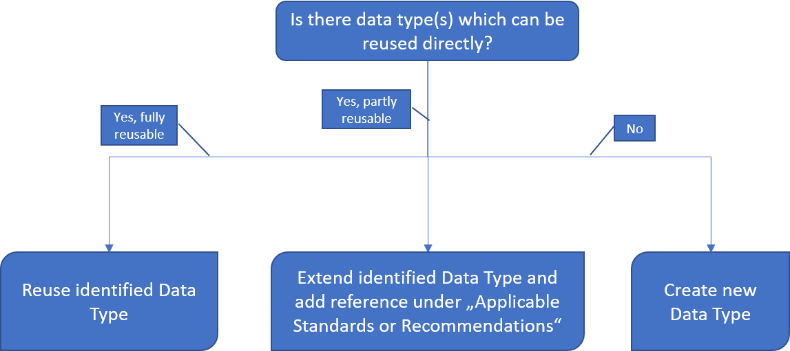

## 1. Search data type registry for suitable data type

This first step assumes, that you have (read) access to a Data Type Registry, e.g., [http://dtr-test.pidconsortium.eu/](http://dtr-test.pidconsortium.eu/). Open the link to the DTR in your Web Browser and query for an existing Data Type, which best describes the digital resource you want to typify.  You may use the following decision graph showing what will be the next step depending on what you found. 

