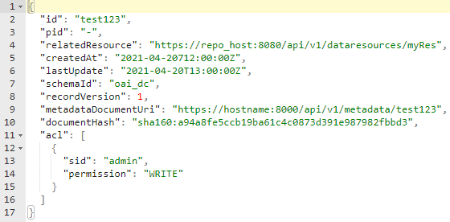

## 2.1 Decide on Data Type‘s level of detail

The following overview shows advantages and disadvantages of choosing a certain level of Data Type granularity. 

Examples:

|| Data Type Name   | Data Type PID              |
| --------------------- | ------------------------------ |----|
| **Granularity 1**           ||                |
|| media-type-IANA-image | 21.T11148/2834eac0159f584bcf05 |
|| media-type-IANA-application | 21.T11148/edff7f2829db22e260a3 |
| **Granularity 2**      ||                |
|| Testbed4inf-Profile               | 21.T11148/61fd3446879407065218 |
|| Kernel_Information_Profile_DARIAH | 21.T11148/f1eea855587d8b1f66da |
| **Granularity 3**         ||                |
|| MemberItem                        | 21.T11148/195f306b750096f4fb6c |
|| Collection                        | 21.T11148/2037de437c80264ccbce |

---

 The main difference of the different levels of granularity is the depth of the resulting Data Type hierarchy. Data Types of *Granularity 1* have no hierarchy at all. Everything they need is defined in one single type. This allows them to be easily created, very generic and they also support basic value validation. Furthermore, their re-usability is comparably high, e.g., as sub-element of other, more complex Data Types.

With *Granularity 2*, Data Types have at least one hierarchy level as they consist of the Data Type itself and one or more sub-elements, which also have a certain Data Type. These sub-elements also cause the additional effort, as the current receipt `Create a Data Type` has to be applied to all of them. As a result, a more in-depth validation of a resource can be performed. The re-usability is still quite high, especially for a specific purpose, e.g., to represent PID Kernel Information Profiles. 

Data Types of *Granularity 3* can be the most complex Data Types. Their intention is to represent a structured resource in detail, e.g., to reflect its entire hierarchy. The main advantage is, that such Data Types allow the full validation of matching resources and a high-degree of machine-readability and -interpretability. However, the effort for creating Data Types of *Granularity 3* can be extremely high, especially for nested hierarchies. Furthermore, as they contain very detailed information about a certain resource, their re-usability is very small.

---

In the course of this receipt, we will model a Data Type of *Granularity 3*. The following sample resource shows the structure we want to represent as a new Data Type.

