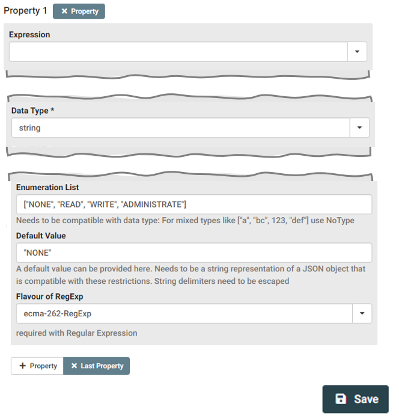
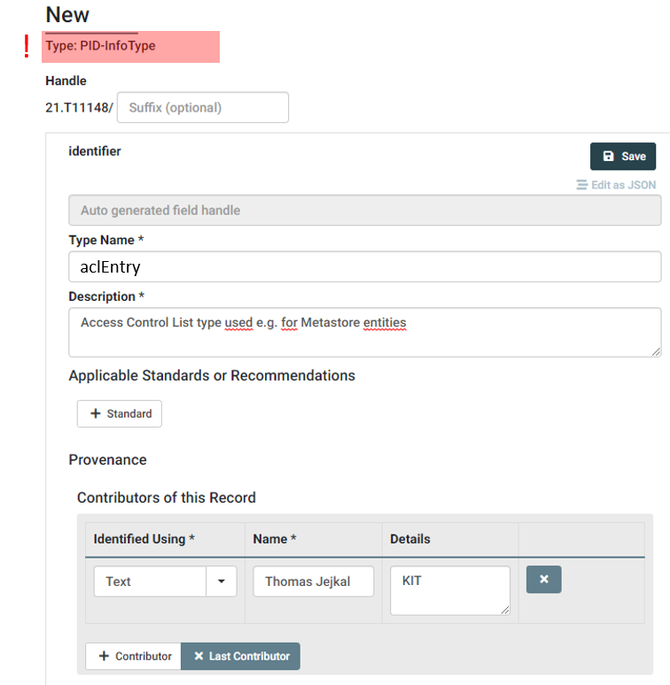
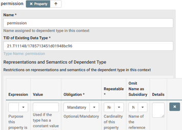

## 3.1 Register new Child-Data Type(s)

Coming back to our `aclEntry` checklist we see, that the `permission` Data Type is missing. We'll now register this new Data Type at our DTR instance.

| Property   | DTR Inquiry Result (Reuse, Extend, Create) |
| ---------- | ------------------------------------------------------------ |
| sid        | Reuse **unicode-line-string** (21.T11148/f1627ce85386d8d75078) |
| permission | Create                        |

>In order to create Data Types at the DTR, write permissions are required. In order to receive proper permissions, you'll have to create a user account. Typically, you'll have to contact the provider of the DTR in order to request a new user account.

After logging in, you are able to create a new Data Type using the `Create` Dropdown Button next to the search field. Here you should select `PID-BasicInfoType`.

As you can see in the screenshot, we just assign a *Type Name* and a *Contributor* in the upper section of the form before we proceed to the lower part. Here we add a new *Property*, assign *string* as *Data Type* and add the enumeration list containing all possible values of our envisioned `permission` Data Type.

We may also assign a *Default Value* before we *Save* the new Data Type. As a result, the Data Type is created and gets a PID assigned. In our case, this PID is `21.T11148/1785713451d01948bc96`, which we add to our checklist for the following step.

| Property   | DTR Inquiry Result (Reuse, Extend, Create) |
| ---------- | ------------------------------------------------------------ |
| sid        | Reuse **unicode-line-string** (21.T11148/f1627ce85386d8d75078) |
| permission | Create **permission** (21.T11148/1785713451d01948bc96) |

Now, we've all elements to create the `aclEntry` Data Type, which will be serve as single element of `aclList` in our modeled structure.

We create a new Data Type but this time, we select `PID-InfoType` at the Dropdown Button.

 

After adding Data Type Name and Contributor we continue with defining the properties. According to our checklist we should add two properties: `sid` and `permission`.

We assign a name, e.g., the name of the attribute in our structure. Under *TID of Existing Data Type* we put in the according PID from our checklist representing the respective property, e.g., *21.T11148/f1627ce85386d8d75078* for *sid*. Furthermore, we may add Representation and Semantics information, e.g., about obligation, repeatability or for providing a constant value. If done, we can save the `aclEntry` Data Type and receive a PID, in our case *21.T11148/1785713451d01948bc96*, which we can now use to define the `aclList` in the next step. 