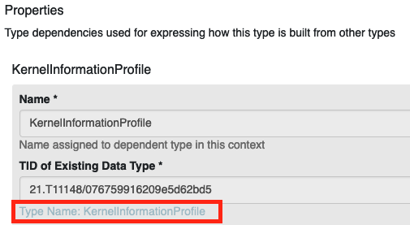
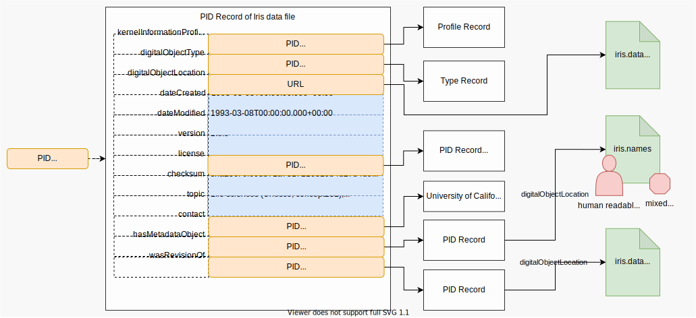

# Create a PID

Creating a PID means not only to register an identifier, but also to fill it with reasonable information at the same time. Creating a PID is therefore the same as "creating a PID record" or similar terms. In some contexts it is also referred to as "creating a FAIR Digital Object" or "minting a PID".

As you can see in the ingredient list, you will need a profile. A reference to the profile will be stored in the record and is used for record validation and easing decision-making for machines. First, search for existing profiles. This will maximize reusability. If no fitting profile exists, you need to create one. [The process of searching or creating of such profiles is already described in another recipe.](../kip_intro.md) It is important that you are able to fulfill the profiles requirements, meaning that you have the information to create a valid record according to this profile (last point in the ingredients).

---

## Ingredients

- A running [Typed PID Maker](../appendix/appendix_pit.md) (or FAIR DO Lab instance)
- [A PID Information Profile](../kip_intro.md) that can properly represent your object you want to represent
- A reference to your data/object (e.g. a URL), which can be used with your profile
- Information which needs to be provided according to the profile

---

## Work Steps (Summary)

1. Build a JSON-Representation of the PID record.
2. Send PID create request to Typed PID Maker.

---

## Step 1: Build a JSON-Representation of the PID record

PID records can be seen as Key-Value-Stores, where the keys are PIDs of types, and the values follow the rules of the type. The Typed PID Maker only creates PIDs with a valid record in the following sense: Each PID record has to contain a PID of a profile. A profile defines which information is mandatory for this record and which information is optionally allowed. It is registered in a data type registry. The types again describe their meaning and their possible values. With this precondition, it is possible to validate if the record follows all rules of the profile:

1.	All mandatory properties defined within the profile are contained within the record.
2.	Only properties defined within the profile are contained (if the profile does not allow arbitrary extra properties explicitly).
3.	All properties have valid values according to their definitions in the DTR.
4.	Every property can be resolved and is defined in a DTR.

Therefore, we need to build a JSON-Representation of the PID record to send to the Typed PID Maker. Usually a program will do this request, in some cases supported by human intervention. The program might be a workflow system, a repository or similar. As you have access to a Typed PID Maker, the documentation of the API is available under its domain (depending on the configuration, something like `http://domain:port/swagger-ui.html`). There you will find the current representation of a PID record within this service, using JSON. The difference to typical Key-Value mappings is that there might be multiple values allowed for some types, depending on the profile. So it can be considered as a mapping in the following sense:

```text
"PID_of_type" -> List["value1", "value2", ...]
```

> Note: The JSON representation additionally might contain a `pid` field. In the creation step, this field is ignored and can be omitted or null. It is used for responses from the Typed PID Maker only. The same goes for other fields like "name", which might contain human-readable names. For creation, only the types and values are important.

The types are defined in the profile you have chosen (or created). The profile also decides if you need to assign a value to the type or if this type is optional. It also defines if a type can have multiple values (repeatability). After receiving the record information, the Typed PID Maker will use the contained profile to validate the information. Only if the validation succeeds, a new PID with the given record information will be registered at the configured PID service. It is therefore important to have a record which is valid according to its self-contained profile. For more information about types and profiles, you might want to read into the following recipes: [Create a data type](../datatypes_intro.md), [Create a profile](../kip_intro.md).


As you already chose the profile, try to fill it at best effort (remember that there are likely some mandatory fields). Note that all records must contain the PID of their profile. This is – again – defined in each profile. The PID will be used by the Typed PID Maker to validate your record. If your record is not valid according to the profile you chose, no PID will be created. More details to that in the next step. Let us assume a [simple profile](http://dtr-test.pidconsortium.net/#objects/21.T11148/0c5636e4d82b88f86132):

| Property                 | mandatory | Description                                                  |
| ------------------------ | --------- | ------------------------------------------------------------ |
| kernelInformationProfile | yes       | PID of the KIP for this PID record                           |
| digitalObjectType        | yes       | PID of the Data Type of the referenced object                |
| digitalObjectLocation    | yes       | Location URL of the referenced object                        |
| digitalObjectPolicy      | yes       | PID of the policy object with e.g. license information       |
| etag                     | yes       | Etag (checksum) of the current state of the referenced object|
| dateModified             | no        | Last modification date of the references object              |
| dateCreated              | yes       | Creation date of the referenced object                       |
| version                  | no        | Version of the referenced object                             |
| wasDerivedFrom           | no        | PID of another object according to [PROV-DM] recommendation  |
| specializationOf         | no        | PID of another object according to [PROV-DM] recommendation  |
| wasRevisionOf            | no        | PID of another object according to [PROV-DM] recommendation  |
| hadPrimarySource         | no        | PID of another object according to [PROV-DM] recommendation  |
| wasQuotedFrom            | no        | PID of another object according to [PROV-DM] recommendation  |
| alternateOf              | no        | PID of another object according to [PROV-DM] recommendation  |

[PROV-DM]: https://www.w3.org/TR/2013/REC-prov-dm-20130430/

[In this example, we use this profile](http://dtr-test.pidconsortium.net/#objects/21.T11148/0c5636e4d82b88f86132). Each profile has a list of properties. Go to the profile definition in the Data Type Registry, scroll to the first property ("KernelInformationProfile") and click on the link to it (displayed as "[type name: KernelInformationProfile](http://dtr-test.pidconsortium.net/#objects/21.T11148/076759916209e5d62bd5)").



On the properties page, you can see that this type has one sub-property, which is also called "KernelInformationProfile" and accepts a Handle-System-PID as a value. In the "Representation and Semantics" section, you can also see that "Abbreviated Form" is set to "Yes". This simplifies the values for this type to ignore the encapsulation and allows us to simply refer to the inner type. Instead of writing

```json
{
  "KernelInformationProfile":
    {"KernelInformationProfile": "some/handleIdentifier"}
}
```

for the value, this allows us to omit the actual parent type:

```json
    {"KernelInformationProfile": "some/handleIdentifier"}
```

And as the inner type has the property `Omit Name as Subsidiary` set to `Yes`, we can also omit the inner types name, too. This means we can simply use a handle PID as a value for the type KernelInformationProfile:

```json
"some/handleIdentifier"
```

On the bottom of the type's page you can find a JSON schema. This schema can be used on a value to validate it. It is a technical representation of the rules set on the types page. On the top of the type page you can find more about its semantics. There is a description and a list of related standards or recommendations.

This procedure can be done similar for all other types to figure out which values are allowed and what the semantic is. Note that all types refer to the object behind the PID record. For example, if a type represents a checksum, it has to be the checksum of the object the record is pointing to, not the checksum of the record or anything else. Keep this as a guideline when figuring out the actual values for your record.

Now, bring your record into the actual JSON representation by figuring out the values for at least all mandatory fields, store the result in a file called `record.json` and continue with step 2. [In our example, the prepared record might look like this](./test.json). Make sure you use the format that fits your Typed PID Maker version. A visual example of how the PID record of the famous Iris dataset could look like is given in the following figure. Note that this is a classical legacy dataset, without proper provenance or licensing information.



## Step 2: Send PID create request to Typed PID Maker

Every instance hosts an interactive API documentation. It is available at `http://domain:port/swagger-ui.html`, where domain and port is specific to your instance. To do a small manual test, the following bash script will help you. In practice, you probably want to do it automatically or build a user interface in case it is done (semi-)manually.

1. [Download the bash script to register a PID](./create_pid.bash). Remember that for a production-configured Typed PID Maker, this will register a real PID.
2. Remember to store the JSON representation into a file in the same directory as the bash script. Call it for example `record.json`. [You may use this example record](./test.json) if you like. Note that its `pid` field contains a PID, which will be ignored for PID creation. There will be a new PID assigned.
3. Open a terminal and execute this command:
    - `bash create_pid.bash $url record.json`
    - where `$url` must be replaced with the hostname and port of the Typed PID Maker (e.g. `https://localhost:8090` if you run the FAIR DO Lab).

On success the service will return the information back to you. It should be exactly the same, but with the PID of your object included. In this example, you can see that we used the sandboxed, temporary PID service for testing: `{"pid":"sandboxed/-647408938","entries":{...}}`
