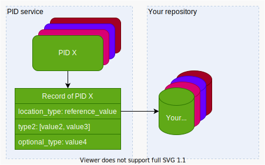
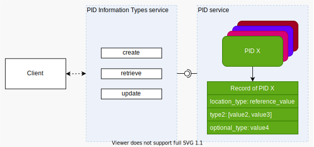

# Introduction: Working with PIDs

**A PID is a unique, persistent and resolvable identifier for an object.** This object might be (meta-)data, data streams, sensors, repositories and more. PIDs are associated with information which helps to access the object and to elaborate the use of the (data) object (PID record information) for the use case of a client. This means that a PID resolves to a "landing page for machines", enabling the client to decide if it can work with this object and to programmatically access it. Therefore PIDs are a vital part of FAIR Digital Objects.

**The following receipts are about working with PIDs** and use the same ingredients and similar steps. Working with PIDs means in this case, to do [CRUD-Operations](https://de.wikipedia.org/wiki/CRUD) (Create, Retrieve, Update, Delete) with PIDs. We use our [Testbed](https://github.com/kit-data-manager/testbed4inf) to elaborate and test generic PID handling and advanced use cases.

> Note that there is no delete-Operation recommended in the context of FAIR Digital Objects, therefore the recipe will not delete it, but show how to handle e.g. the loss of the actual data in terms of PID curation.

---

## Recipes

- [Create a PID](./create.md)  
    This is also known as "Creating a FAIR Digital Object" or "Creating a PID Record".
- [Resolve a PID](./resolve.md)  
    This is the action to get the content of a PIDs record, which is the "landing page for machines" This is the first information a machine can get and make first decisions.
- [Update a PID](./update.md)  
    PIDs and their contents ideally remain constant. For data curation reasons there still might be reasons where someone wants to update the PID record, for example to update the new object location, when a server has moved.
- [Delete a PID](./delete.md)  
    Deleting is against the P(ersistent) in PID. There are cases where you might feel the need to delete PIDs. But in FAIR ecosystems, the solution is usually a PID record update. This recipe is about why you should not delete PIDs and about guidelines that discuss which modifications should be done on such a record, and which shouldn't.

