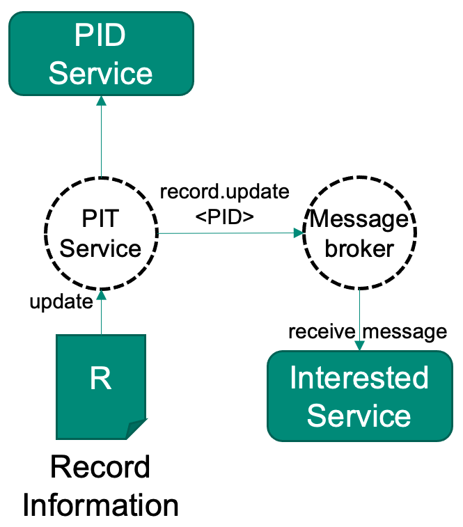

# Inform other systems about changes among your PIDs

If a PID has been created or a record has been updated, there might be the need to notify other services about this event. These might be internal or external services to be notified, depending on the use case. Examples are library systems, catalogues, search indices or backup systems. The receiving services could also be bridges to other technologies, like RSS feeds of data publications of a certain kind or other user oriented technologies. Bridging services might also help to close gaps if underlying technologies like TCP/IP change at some point of time.

This recipe shows the steps needed to notify a service.

---

## Ingredients

Either

- A [FAIR Digital Object Ecosystem Testbed](../appendix/appendix_testbed.md) instance, which comes with pre-configured with the ingredients below

or

- A message broker instance, AMQP compatible
- Access to a [Typed PID Maker](../appendix/appendix_pit.md) configured to use the message broker instance
- A service that should be notified, implementing the AMQP protocol

---

## Work Steps (Summary)

As soon as the Typed PID Maker is configured to use the message broker, everything happens in the background. These steps show you how to visualize what happens hidden in the background, when using the testbed.

1. Run the service that should be notified and register it at the message broker.
2. Do any [create](./create.md) or [update](./update.md) operation on the Typed PID Maker.
3. Use the management interface to see the messaging process happening within the message broker.
4. View the result of your service.

---

## Step1: Run the service that should be notified and register it at the message broker

The [testbed](../appendix/appendix_testbed.md) implements the messaging principle using a message broker[^messagebroker]. It is a flexible approach that also enables federation and peering. The Typed PID Maker instance is by default configured to notify this service about create or update operations using a message. The message only contains a topic string and the PID this message is about. Services need to register in beforehand at the message broker for certain topics in order to receive those messages. It is up to the services what to do with the PID inside. The idea is to use the machine actionability of FAIR Digital Objects to enable services to decide themselves how to handle the received PID and information and data that can be reached by it.

If you use a testbed instance with its default configuration, you can skip this step. It already comes with an indexing service running in the background. If you use your own service, register for all topics beginning with "record.*".

[^messagebroker]: Currently, RabbitMQ is used as a message broker. It implements the „Advanced Message Queuing Protocol“ (AMQP) <https://www.rabbitmq.com/>

## Step 2: Do any create or update operation on the Typed PID Maker

Follow one of the following recipes to trigger a notification:

1. [Create a PID](./create.md)
2. [Update a PID](./update.md)

Both actions trigger notifications. Notifications are currently very small. They simply contain a topic string and a PID, which the receiver may resolve and decide how to act on it. A create event notification might contain the topic "record.create", while an update event notification might have the topic "record.update".

## Step 3: Use the management interface to see the messaging process happening within the message broker

Using the testbed, you can access a management interface within your browser, using the following credentials:

- URL: <http://localhost:15672/>
- Username: guest
- Password: guest

On the first page in the dashboard, you should see something like this graph:

It indicates an incoming message. Feel free to also explore the exchange and queues in the interface. If you used your own message broker, the interface might look different.

## Step 4: View the result of your service

If you use the testbed, see if your action is represented in the contained search index. You can read about how to access in the [search recipe](./search.md). If you use your own service, check if it acted as expected.
