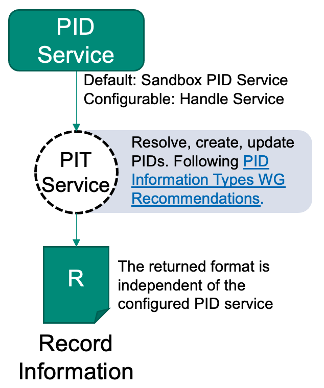

# Resolve a PID

Resolving a PID (also "retrieving/reading a PID (record)") is the process of submitting the PID to a system in order to receive the associated PID record as a response. It is sometimes also called "resolving a FAIR Digital Object", although this term is also used to refer to the process of accessing the actual data object which makes it a vague term. Resolving allows machines to read (and act on) the PIDs record information.

In contrast to the modifying use cases ([create](./create.md) and [update](./update.md)), the record is currently not being validated during this operation. The reason is that neither the machine nor the user is able to prevent the record from being invalid within a reading operation. If the received record contains a profile, the Typed PID Maker can be explicitly requested to validate the PID record if the user or tool needs this information.

---

## Ingredients

- A registered PID you want to resolve.
- Access to a [Typed PID Maker](../appendix/appendix_pit.md) or a Testbed instance.
    - Alternatively, try it in your browser!

---

## Work Steps (Summary)

1. Resolve a PID

---

## Step 1: Resolve a PID

The Typed PID Maker offers an API to resolve PIDs. The principle is simple: You give it the API and will get a JSON document in return, which contains the content of the PIDs record. If you want to do it quick, there is an explanation below how to simply resolve a PID in the browser.



### Using the Typed PID Maker

The advantage of this method is that the Typed PID Maker is an abstraction of the PID system used. This means that if you switch the system in the background, the API will stay the same. The resolving step does currently not involve any FAIR or profile validation.

1. Download [resolve_pid.bash](./resolve_pid.bash)
2. Run this in your terminal: `bash resolve_pid.bash $url "$pid"`
    - where `$url` must be replaced with the hostname and port (e.g. `https://hostname:port`)
    - where `$pid` must be the PID you want to resolve.

The result will be the same as after creating a PID: A JSON document that contains the record information similar to this:

```json
{"pid": "sandboxed/406871","entries": {...}}
```

### Using the handle resolver (try it in your browser!)

> Note: Like with the Typed PID Maker, this only works with PIDs built upon the handle system. If you use another system, you need to look for a compatible web-resolver. This will also not work with sandboxed PIDs in the Typed PID Maker.

1. Go to <https://hdl.handle.net>.
2. Insert the PID in the "Handle" field. If you do not have any PID at hand, try for example `21.T11998/0000-001A-3905-F`. 
3. Check the "Don't redirect to URLs" option.
4. Click on the "Submit" button.

You will see a table, similar to the one after this paragraph. It contains a "Type" column, which for a real FAIR Digital Object **must** contain only PIDs. Exceptions are other types that are required by a PID system, often containing specific, administrative information. The "Data" column contains the value of the according type in the same line. All other columns are handle specific. Here you can see an excerpt of a handle PID record:

| Index | Type | Timestamp | Data |
|-------|------|-----------|------|
| 1 | 21.T11148/8eb858ee0b12e8e463a5 | 2021-04-19 08:59:03Z | {"identifierValue": "http://hdl.handle.net/21.T11998/0000-001A-3905-F", "identifierType": "Handle"} |
| 3	| 21.T11148/9a15a4735d4bda329d80 | 2021-04-15 10:47:38Z | https://linkedsystems.uk/system/instance/TOOL0022_2490/current/ |
| 4 | 21.T11148/709a23220f2c3d64d1e1 | 2021-04-15 10:47:38Z | Sea-Bird SBE 37-IM MicroCAT C-T Sensor |
|12 | 21.T11148/eb3c713572f681e6c4c3 | 2021-04-19 10:41:18Z | [{ "alternateIdentifier": {"alternateIdentifierValue": "2490", "alternateIdentifierType": "serialNumber" }}] |
|13 | 21.T11148/178fb558abc755ca7046 | 2021-04-19 10:41:18Z | [{"relatedIdentifier": {"relatedIdentifierValue": "https://www.bodc.ac.uk/data/documents/nodb/pdf/37imbrochurejul08.pdf", "relatedIdentifierType": "URL", "relationType": "IsDescribedBy"}}] |
