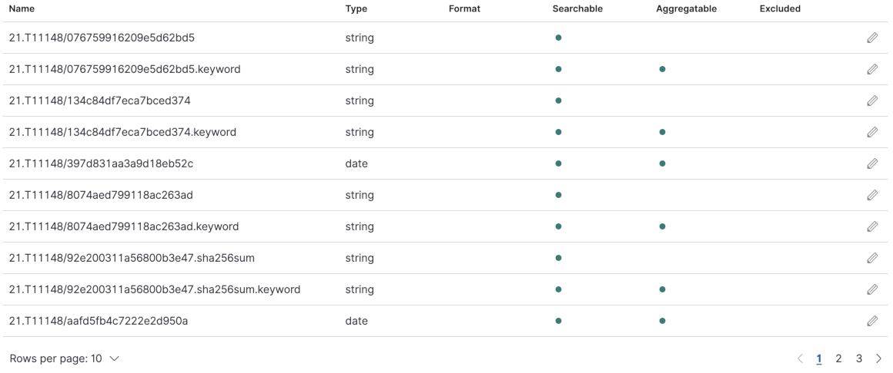
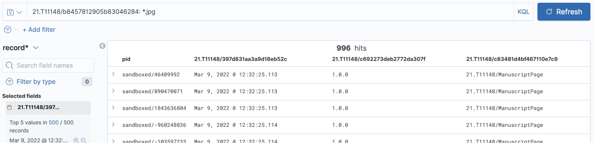

# Search PIDs using record information

It is a common use case to search for PIDs using the record information or have an automatically created list of all registered PIDs. This recipe will introduce how to enable these use cases using a search index. This approach generally works using the [messaging approach to notify other services](./notify.md). In this case an indexer service will receive the notifications and keep the search index up-to-date. Depending on how much information is ingested into the search index, it may also enable complex analysis of FAIR Digital Objects.


This approach is implemented in the [FAIR Digital Object Lab](../appendix/appendix_fair-do-lab.md). Currently, the indexing functionality has to be set up before the PIDs are registered or changed to make sure they are indexed. To also retrieve older PIDs which are not changing, ecosystems must offer further approaches, like regular "record.refresh" messages, indicating non-changing PIDs regularly or other interfaces to order older PIDs.

---

## Ingredients

Either

- A [FAIR Digital Object Lab](../appendix/appendix_fair-do-lab.md) instance, which comes with pre-configured with the ingredients below and will save you step 1 (configuration)

or

- One or more message brokers
- A search index (like Elasticsearch, for example)
- An indexer service with AMQP support, which ingests PIDs and record information into the search index

---

## Work Steps (Summary)

As soon as the Typed PID Maker is configured to use the message broker, everything happens in the background. These steps show you how to visualize what happens hidden in the background, when using the FAIR DO Lab.

1. Configuration (not required if the Lab is used)
2. Create some PIDs with record information
3. Use the search index to search for PIDs

---

## Step 1: Configuration (not required if the FAIR DO Lab is used)

The FAIR DO Lab is pre-configured to fulfill this use case in the following ways:

1. The Typed PID Maker is configured to send messages to a message broker if PIDs are created. In its `application.properties` configuration file, we need to configure the message broker and exchange:
    ```yaml
    repo.messaging.enabled: true
    // hostname and port of your message broker instance
    repo.messaging.hostname: messagebroker
    repo.messaging.port: 5672
    // the exchange the messages are sent to
    repo.messaging.sender.exchange: record_events
    ```
2. The Indexer will register itself for PID-related messages on start.  In its `application.properties`configuration file, we use the same settings as above to connect it to the same broker and exchange. Additionally, we configure it to a queue, which usually should be a unique name for this service. The `routingKeys` parameter defines which message topics are handled by the indexer. The Typed PID Maker sends messages with topics like `pidrecord.create` and `pidrecord.update`. The value `pidrecord.#` means to handle every message with a topic that has `pidrecord.` as a prefix.
    ```yaml
    repo.messaging.enabled: true
    repo.messaging.hostname: messagebroker
    repo.messaging.port: 5672
    repo.messaging.receiver.exchange: record_events
    repo.messaging.receiver.queue: indexerQueue  // name of the queue
    repo.messaging.receiver.routingKeys: pidrecord.#  // message topics which are handled
    ```

In case you do not use the FAIR DO Lab and instead do your own setup, make sure it is configured this way.

## Step 2: Create some PIDs with record information

Use the [recipe to create PIDs](./create.md) to create a few dummy PIDs. We recommend configuring the Typed PID Maker with `pit.pidsystem.implementation = IN_MEMORY` in its `application.properties` configuration file.

## Step3: Use the search index to search for PIDs

As the Typed PID Maker and the Indexer have been configured accordingly in step 1 (or the default configuration of the FAIR DO Lab has been used), the PIDs should have been indexed shortly after their creation. We can now use the index to query information from it. How to do this will depend on your search index engine. We will demonstrate this on the FAIR DO Lab, which uses Elasticsearch as index as well as Kibana for administration and exploration.

1. Visit <http://127.0.0.1:5601/app/kibana#/discover>
2. Use "record*" as index pattern and click "Next step"
3. In the next screen, you may choose a property to use as time filter or "I don't want to use the Time Filter". Then click on "Create index pattern"
4. You will now see an overview over the index pattern, stating which properties do exist and which internal type they have.
    
5. Visit <http://127.0.0.1:5601/app/kibana#/discover> again
6. You can now use the Kibana Query Language and Filters to query your PIDs and select which fields to display. Note that this is just an exploration functionality, and Elasticsearch is a widespread engine offering APIs for all kinds of custom search use cases.

    
